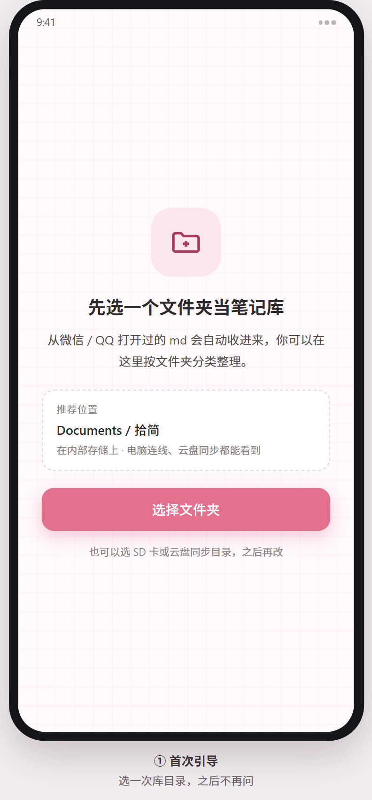
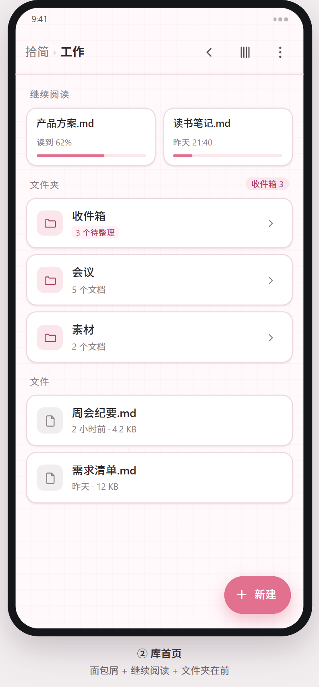
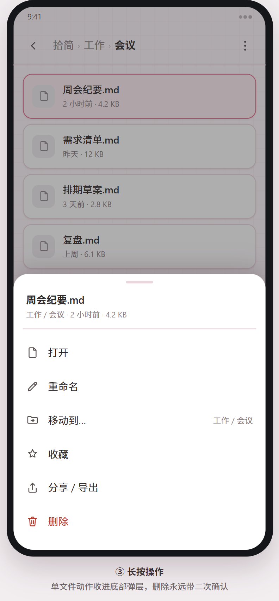
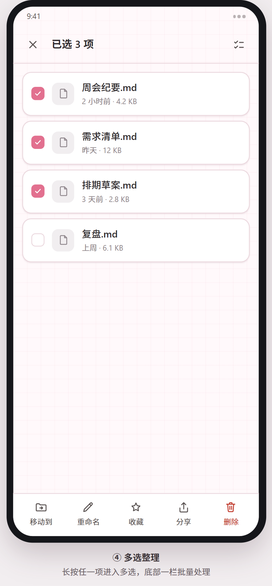
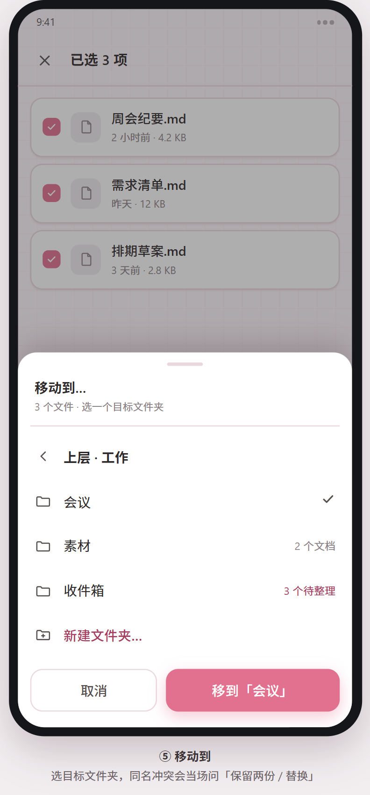
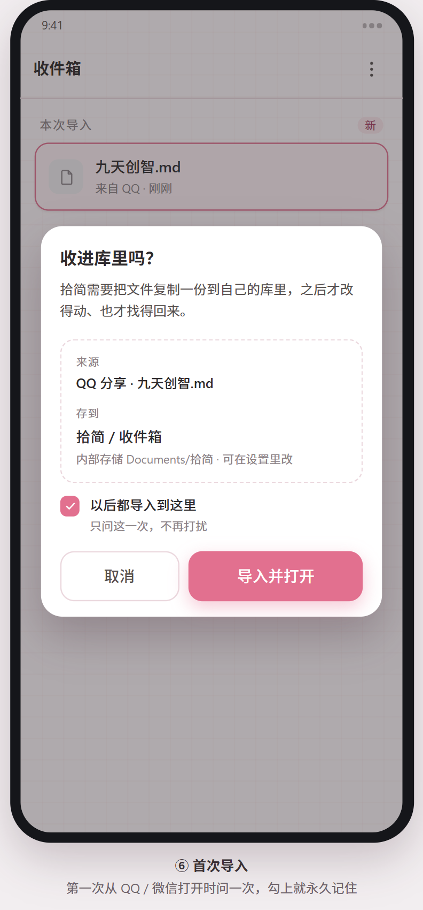
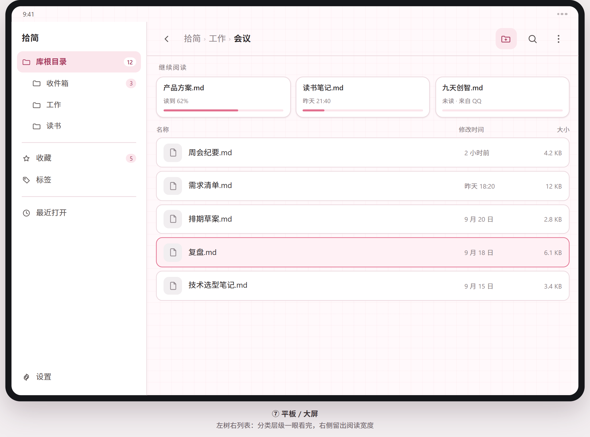

# 拾简 · Shijian

面向**手机与平板**的 Markdown 阅读 / 编辑应用。原生 Kotlin + Jetpack Compose 实现，**不用 WebView**；视觉语言参考 Typora 的 phycat 主题族后重新设计，针对触屏操作与多尺寸屏幕重新排版。

> **Shijian** — a native Kotlin + Jetpack Compose Markdown reader / editor for Android phones and tablets. No WebView, 12 theme families, a real folder-based note library with trash, tablet-optimized layout.

<p align="center">
  
</p>

| 项 | 值 |
| --- | --- |
| 应用名 | 拾简 |
| 包名 | `com.shijian.md` |
| 当前版本 | v0.2（2026-09），见 [下载](#下载) 与 [版本历史](#版本历史) |
| 技术栈 | Kotlin 2.2 · Jetpack Compose · Material 3 · commonmark 0.30 · Coil 3 |
| 构建 | AGP 9.4 · Gradle Wrapper · JDK 21 |
| minSdk / targetSdk | 24 / 37（compileSdk 37），覆盖约 98% 在用设备 |
| 默认主题 | 樱（sakura） |
| 网络 | 不申请 `INTERNET` 权限，文档只在本机处理 |
| 界面语言 | 简体中文 |

---

## 下载

| 版本 | 内容 | 产物 |
| --- | --- | --- |
| **v0.2**（最新） | 笔记库与文件管理 | [Releases · 最新](https://github.com/C-silence/Shijian-MD/releases/latest) |
| v0.1 | 首个可安装版本 | [Releases · v0.1](https://github.com/C-silence/Shijian-MD/releases/tag/v0.1) |

Releases 里的 APK 就是 `:app:assembleDebug` 的直接产物（debug 签名），下载后侧载安装即可，Android 7.0（minSdk 24）及以上。
同一台机器构建的包能直接覆盖升级，库里的文件和设置都保留；安装时若提示「未知来源」，在系统设置里允许这一次安装就行。

---

## 界面预览

> 下列图片是开工前用 HTML 做的**静态视觉稿**（1px ≈ 1dp），用来先把版式层级和配色定下来；正式实现是 Compose 原生渲染，按同一套规范落地。可交互原型见 [`docs/mockups/拾简视觉稿.html`](docs/mockups/拾简视觉稿.html)（浏览器打开，右上角切主题）。

### 手机 · 阅读与编辑

<p align="center">
  
  
</p>

### 主题（12 族里的浅色三族）

<p align="center">
  
  
  
</p>

### 平板 / 大屏

<p align="center">
  
  
</p>

### 细节

<p align="center">
  
  
</p>

### 笔记库与文件管理（v0.2）

> 视觉稿见 [`docs/mockups/文件管理视觉稿.html`](docs/mockups/文件管理视觉稿.html)：把「打开一个 md」变成「一类笔记一个文件夹」的完整流程。

<p align="center">
  
  
  
  
</p>

<p align="center">
  
  
  
</p>

---

## 功能

### 阅读

- 原生 Compose 渲染，不用 WebView：标题 / 列表 / 引用 / 代码块 / 表格 / 分割线 / 图片 / 属性卡 / 公式块各有独立版式
- 标题六级各有形状标识（H1 居中短条 / H2 胶囊 / H3 左竖条 / H4 实心点 / H5 空心点 / H6 短横）
- 任务列表复选框可直接点选，**改动写回源文件**（设置里可关）
- 目录抽屉：手机从左侧滑出，平板（≥840dp）可常驻左栏，正文列宽上限 720dp
- 正文列宽、页边距随窗口宽度自适应；字号 **10–22sp** 可调，右下角显示阅读进度
- 悬浮回顶按钮：滚出首屏后淡入，一点回文首；编辑模式下按光标位置出现，并自动让开底部工具条
- 代码块带语法高亮，行内代码、粗斜体、删除线、高亮、脚注、`<kbd>` 均有对应样式

### 编辑

- 源码编辑 + 实时分栏预览；Markdown 语法着色用 `VisualTransformation` 实现，零拷贝
- 底部插入工具条：标题 / 粗体 / 斜体 / 删除线 / 高亮 / 行内码 / 代码块 / 列表 / 任务 / 引用 / 链接 / 表格 / 分割线 / 图片
- 自动保存：停止输入约 1.2 秒写回（可在设置里关）；未命名文档自动存草稿，下次启动可继续
- 解析在 `Dispatchers.Default` 上做，输入防抖 200ms，长文档不卡输入

### 主题（12 族）

- 浅色 9 族：樱、焦糖、薄荷、天青、森、紫藤、靛、樱红、石墨
- 深色 3 族：松烟、夜幕、墨黑；每个浅色族也派生一套深色（降饱和、提亮主色）
- 三档纹理强度（完整 4.5% / 克制 2% / 极简 0%），6 种矢量底纹（网格 / 交叉 / 点阵 / 星点 / 六边 / 三角）
- 护眼纸质模式可叠加在任意主题上；深浅模式支持跟随系统

### 文件

- SAF 打开 / 另存为 / 写回，支持 `ACTION_VIEW`、`ACTION_EDIT`、`ACTION_SEND` 三种外部入口
- 外部分享来源（QQ / 微信 / 钉钉基本只给读授权）先复制一份进笔记库的「收件箱」，之后改的是库里那份，原文件不动
- 编码自适应：BOM → UTF-8 严格解码 → GBK 回退
- 最近打开列表（本机记录，可单条移除）；授权已失效的条目会标「需重新授权」

### 整理（笔记库）

- 笔记库 = 你自己选的一个普通文件夹（默认 `Documents/拾简`），**只问一次**，之后重启、升级都不再问
- 库内可**新建文件夹 / 新建文档**，随手拉分类；分类目录在电脑上看到的也是同一批目录
- 「从本机导入文件」落在**当前打开的这个文件夹**里；只有 QQ / 微信这类外部分享才默认进「收件箱」等着整理
- 长按任一条目进入**多选**，底部一栏批量「移动 / 重命名 / 导出 / 删除」；顶栏可全选
- 「移动到…」弹层里点文件夹就是往里走一层，底部按钮把东西搬进当前这一层；重名会当场问「都留着 / 替换」
- 删除先进**回收站**（库根下的 `.trash/`），7 天后自动清理，期间可随时还原或彻底删除
- 平板（≥840dp）左侧常驻一栏：全部笔记 + 一级文件夹 + 回收站 + 最近打开 + 设置

### 设置

- 主题与深浅模式、纹理强度与底纹样式、护眼纸质模式
- 正文字号 10–22sp（下限就是 10sp）
- 自动保存开关、任务勾选回写开关、目录面板开关、阅读时常亮
- 笔记库：当前库位置、更换文件夹、导入确认开关、清除设置（不动库里的文件）

---

## 屏幕适配

按窗口宽度分三档，用 `LocalConfiguration.screenWidthDp` 判定（见 `ui/WindowSize.kt`）：

| 档位 | 宽度 | 典型设备 | 布局 |
| --- | --- | --- | --- |
| `COMPACT` | < 600dp | 手机竖屏 | 单栏；目录从左侧滑出；顶栏用图标切换阅读 / 编辑 |
| `MEDIUM` | 600–839dp | 手机横屏、折叠屏展开、小平板 | 内容区加宽，模式切换用胶囊按钮 |
| `EXPANDED` | ≥ 840dp | 平板 | 大纲 / 编辑 / 预览可三栏并存，大纲栏 212dp |

另外：所有可点元素按 ≥ 44dp 触摸目标设计；排版尺寸全部走 dp / sp，不写死像素，规避不同密度屏幕的错位。

---

## 架构

```
外部入口（ACTION_VIEW / EDIT / SEND / 应用内导入）
   ↓
DocIo            SAF 与文件读写、URI 授权判定、编码嗅探
Library          库目录列举、新建 / 移动 / 改名 / 删除、`.trash` 回收站
LibraryStore     库目录授权与逻辑根（只问一次）；TrashStore 记回收站账本
   ↓
AppViewModel     文档状态、防抖解析、防抖保存、任务回写、最近记录、库操作
   ↓
MdParser         commonmark + GFM 扩展 → MdBlock 语义块
   ↓
Compose          LibraryScreen 浏览整理；ReaderPane / EditorPane 按块渲染
```

目录结构：

```
app/src/main/java/com/shijian/md/
├── MainActivity.kt            入口，处理外部 Intent
├── AppViewModel.kt            文档状态、解析、保存、任务回写
├── data/                      SettingsStore / RecentStore / DocIo / Library / LibraryStore / TrashStore
├── md/                        MdModel / MarkdownParser（commonmark → 语义块）
└── ui/
    ├── AppRoot.kt             主题包装 + 页面路由 + 提示条
    ├── DocumentScreen.kt      顶栏、模式切换、目录、阅读底栏
    ├── WindowSize.kt          断点分级
    ├── components/            矢量图标、应用标记、行内渲染、块级渲染、代码高亮
    ├── home/                  笔记库浏览、分类整理、回收站、导入弹层
    ├── editor/                源码编辑与插入工具条
    ├── reader/                阅读分栏与目录
    ├── settings/              主题与偏好设置
    └── theme/                 主题令牌与 12 族配色
```

---

## 构建

环境：JDK 21 + Android SDK（compileSdk 37）。依赖都在 `gradle/libs.versions.toml` 里，Gradle Wrapper 会自己拉。

```powershell
.\gradlew.bat :app:assembleDebug        # 产物：app\build\outputs\apk\debug\app-debug.apk
.\gradlew.bat :app:testDebugUnitTest    # 解析层单元测试
```

本仓库额外带了一个 `build.cmd`：它会先清空 `JAVA_HOME` 再调用 Gradle，用来绕开本机 `JAVA_HOME` 指向失效路径的问题，等价于：

```powershell
.\build.cmd :app:assembleDebug
.\build.cmd :app:testDebugUnitTest
```

安装到设备：

```powershell
adb install -r app\build\outputs\apk\debug\app-debug.apk
```

---

## 文档

| 文件 | 内容 |
| --- | --- |
| [`docs/项目设计文档.md`](docs/项目设计文档.md) | 需求、设计决策、元素规范、里程碑 |
| [`docs/实现说明.md`](docs/实现说明.md) | v1 实现说明、已知边界、验证记录 |
| [`docs/mockups/拾简视觉稿.html`](docs/mockups/拾简视觉稿.html) | 可交互原型（樱 / 焦糖 / 薄荷 + 樱深色） |
| [`docs/mockups/文件管理视觉稿.html`](docs/mockups/文件管理视觉稿.html) | v0.2 笔记库与分类整理的流程视觉稿 |
| [`docs/mockups/README.md`](docs/mockups/README.md) | 视觉稿清单与评审要点 |

---

## 已知边界（有意为之）

- **远程图片不加载**：应用未申请 `INTERNET` 权限，远程图片显示占位卡；本地相对路径按文档所在目录解析
- 行内图片（段落中间）以 `[图片: 描述]` 占位，独立成段的图片才整幅渲染
- Mermaid 不做；数学公式 v1 以等宽降级呈现，v1.2 接真渲染
- 行内所见即所得排在 v1.1，v1 是「源码编辑 + 分栏预览」
- 外部分享来源只能读时导入私有副本编辑，原文件不会被改动（Android 的授权模型决定）
- 尚未做多机型 / 多 Android 版本的兼容性矩阵测试

---

## 版本历史

| 版本 | 时间 | 主要内容 |
| --- | --- | --- |
| **v0.2** | 2026-09 | 笔记库与文件管理：授权一次记住一个真实文件夹，库内建文件夹 / 建文档、多选批量整理、移动到…、回收站；首页从「最近打开」改成库浏览并给顶栏加上应用标记 |
| v0.1 | 2026-09 | 首个可安装版本：原生阅读 / 源码编辑 / 分栏预览、任务勾选回写、12 族主题、平板三栏、一键回顶 |

v0.2 的明细：

- 库 = 你自己选的一个普通文件夹（默认 `Documents/拾简`），**只问一次**，不建数据库、不做私有副本，电脑上看到的目录就是 App 里看到的
- 「从本机导入文件」落在**当前所在的文件夹**，只有 QQ / 微信这类外部分享才进「收件箱」等整理
- 长按多选 + 底部批量栏（移动 / 重命名 / 导出 / 删除）；「移动到…」逐层钻取，重名当场问「都留着 / 替换」
- 删除先进库根的 `.trash/`，7 天后惰性清理，期间可还原 / 彻底删除 / 清空
- 平板（≥840dp）左侧常驻一栏；首页标题居中、顶栏左侧加应用标记（标记配色跟随主题）

---

## 后续版本

- **v1.1**：行内所见即所得（在阅读视图里直接改文字）
- **v1.2**：数学公式真渲染（KaTeX 兼容子集）；Mermaid 不做

---

## 应用图标

图形取自应用自身的版式语言——**短标题条 + 三行正文条**（对应 H1 短横与正文行），底色是默认主题「樱」的主色阶梯（#F79BB6 → #E0668C → #821C42）。


- 自适应图标：`drawable/ic_launcher_background.xml`（渐变）+ `ic_launcher_foreground.xml`（图形）+ `ic_launcher_monochrome.xml`（Android 13 主题化图标剪影）
- 低版本回退：`mipmap-{m,h,xh,xxh,xxxh}dpi/ic_launcher.png` 与 `ic_launcher_round.png`
- 重新生成位图：`powershell -File tools\make-icons.ps1 -Sizes "48,72,96,144,192"`（几何改动后需同步手写矢量 XML）
- 界面里复用了同一组几何：`ui/components/AppMark.kt` 用 Canvas 重画那四条圆角条，底色换成**当前主题**的 `primary → primaryDeep` 渐变、条色用 `onPrimary`，所以 12 族主题各有各的标记配色（浅色族是白条，松烟 / 夜幕 / 墨黑用暗条）。笔记库顶栏（30dp）与「最近打开」页头（46dp）共用这一个组件

---

## 致谢

- 主题设计的参考起点是 [Typora](https://typora.io/) 的 phycat 主题族，本项目按其配色思路重新推导为 Compose 令牌，未直接复制其 CSS 数值
- Markdown 解析：[commonmark-java](https://github.com/commonmark/commonmark-java)
- 图片加载：[Coil](https://coil-kt.github.io/coil/)
