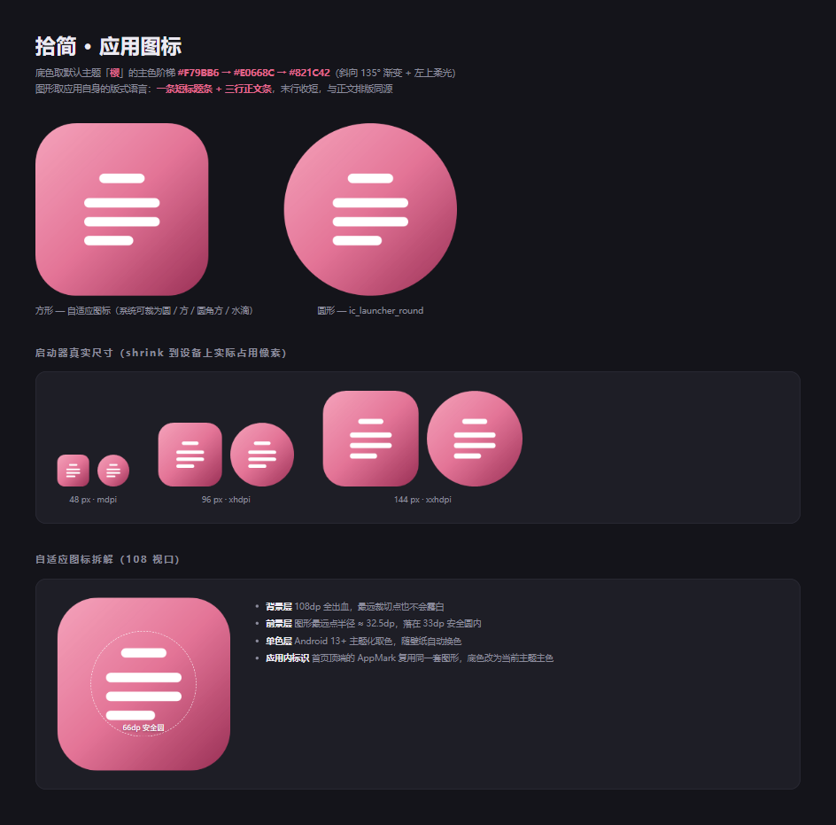

# 拾简 · v1 实现说明

本文记录 v1 的落地方式、关键取舍与验证情况。需求与视觉规范以 `项目设计文档.md` 为准。

---

## 1. 分层

```
MainActivity  ──  Intent(VIEW/EDIT/SEND) ──┐
                                           ▼
AppRoot ── ShijianTheme(spec) ── MdSurface ── DocumentScreen / HomeScreen / SettingsScreen
                                                   │
                            AppViewModel ──────────┤  状态：选中文档、模式、解析结果、保存
                              │        │
                    data/     │        └── md/   解析：commonmark → MdBlock 列表
             SettingsStore    │            MdParser / MdModel
             RecentStore      │
             DocIo ───────────┘  SAF 读写 + 编码嗅探
```

Compose 侧不持有业务状态：`AppViewModel` 用 `mutableStateOf` 暴露 `doc / parsed / mode / toast`，UI 只读不写。

---

## 2. 解析管线（`md/MarkdownParser.kt`）

1. **预处理**：把 `<kbd>x</kbd>` 换成行内代码，避免为键帽单独造节点；其余 HTML 原样保留。
2. **解析**：commonmark 0.30 + 四个扩展（表格、删除线、任务列表、YAML front matter），并开启 `IncludeSourceSpans.BLOCKS_AND_INLINES` 以便回溯源位置。
3. **自定义语法**：注册两个 `DelimiterProcessor` —— `==高亮==` 与 `$公式$`。
   - 0.30 的接口已改为 `getOpeningCharacter/getClosingCharacter/getMinLength/process(opener, closer): Int`，`process` 返回消费的分隔符数量。
   - 公式做了防误伤：单 `$` 时要求内容首尾非空白、且含非数字字符（`$5`、`$8 元` 不会变成公式）；`$$…$$` 判为独立公式块。
   - `$` 的分隔符 run 在行首/行尾不满足左右 flanking 规则，因此另在段落层面识别整段 `$$…$$`。
4. **AST → 模型**：转成扁平的 `MdBlock` 列表（阅读视图用 `LazyColumn` 按块回收），块内文本转成 `Inline` 树。列表用 `depth` 表达层级而不嵌套组件，避免深层缩进带来的测量开销。
5. **副产品**：标题同时产出目录条目（含块下标，供锚点跳转），并统计中英文字数。

### 任务回写

阅读模式勾选任务时，需要精确改写源文件里的那一个字符：

- 首选 `TaskListItemMarker` 的 `SourceSpan.inputIndex`；
- 该自定义节点在部分路径下拿不到源信息，因此按**行号 + 正则**回退定位 `[ ]`，取 `'['` 的绝对偏移；
- 写回只替换 `markerIndex + 1` 这一个字符（`' '` ↔ `'x'`），不触碰其余文本，随即保存。

---

## 3. 主题系统（`ui/theme/Theme.kt`）

- 12 个主题族由一组种子色派生：背景、表面、分隔线、三级文字、主色四档（primary / deep / soft / whisper）、代码与语法色。
- 浅色族在深色模式下**派生**深色：保持色相，饱和度压到 7%–26%，亮度抬到 10%–24%，主色提亮，避免直接反色导致刺眼。
- 护眼纸质模式在浅色基础上叠加纸张底色与暖调文字，深色主题下不生效。
- 底纹用 `ImageShader` 以 20dp 为单元格绘制 6 种矢量图案，按装饰档位取 4.5% / 2% / 0% 透明度——不用位图、不进 apk 资源。
- 所有派生结果按 `族|深浅|档位|字号|护眼` 做缓存，切主题即时生效。
- 正文字号可调范围 10–22sp（`SettingsStore.MIN_BODY/MAX_BODY`，设置页滑块直接读这两个常量，不另写死区间）。其余字号都按正文倍数派生，因此在 `typography()` 里加了 10sp 的绝对下限 `MIN_TEXT_SP`：字号 ≥ 12.5sp 时所有派生值都在线下，既有观感不变；只有把正文调到 10–12sp 时，`caption`/`kbd`/`label` 这类辅助文字才会被托住，不会掉到 8sp 那种读不动的尺寸。
- **Material3 1.4 起 `MaterialTheme` 不再代设 `LocalContentColor`**（该 local 的默认值是纯黑）。因此 `ShijianTheme` 显式提供 `LocalContentColor provides spec.colors.onBackground`，阅读区的 `InlineText` 也把 `color` 从可空改为必填、默认 `onBackground`——堵死「静默回退成黑色」这条路：浅色下黑字看着正常，深色下就是黑底黑字。

字号、行高、圆角、页边距、正文列宽上限都收敛在 `ThemeSpec` 里，组件只读令牌，不写死尺寸。

---

## 4. 响应式布局

| 窗口宽度 | 布局 |
| --- | --- |
| < 600dp | 单栏；顶栏一个按钮在阅读/编辑间切换；目录为左侧抽屉 |
| 600–839dp | 阅读/编辑/分栏三选一；目录抽屉 |
| ≥ 840dp | 目录常驻左栏（212dp）+ 内容；分栏时编辑与预览各占一半 |

正文列宽上限 720dp 并居中，页边距手机 16dp、平板 28dp，触摸目标不小于 40–44dp（顶栏图标 44dp、底栏 52dp）。

---

## 5. 编辑器

- `BasicTextField` + `VisualTransformation`：把源码按行着色（标题、引用、列表标记、复选框、链接、行内码、粗斜删高亮、前置元数据、围栏代码），`OffsetMapping.Identity` 保证光标位置不变。
- 插入工具条在光标/选区处做三种操作：包裹（`**粗**`）、行首前缀（`- ` / `> `）、片段插入（代码块、表格）。全部基于 `TextFieldValue` 的纯函数实现。
- 自动保存 1.2 秒防抖；未命名文档写入 `filesDir/draft.md` 并在首页提供「继续上次的草稿」。
- 回顶按钮：阅读与分栏预览共用同一个 `LazyListState`，直接观察 `firstVisibleItemIndex`/`firstVisibleItemScrollOffset`（阈值 160dp）决定显隐，点击 `animateScrollToItem(0)`。源码编辑没有对外暴露的滚动量，改看 `TextFieldValue.selection`——把光标移到文首即可，`CoreTextField` 的 `VerticalScrollLayoutModifier` 会在光标矩形变化时自动把光标滚进可视区（已核对 Compose Foundation 1.12.1 源码）。按钮 44dp 圆形，编辑模式下底部让开 `EditorToolbarHeight`（56dp）并同样带 `imePadding()`，与工具条一起随键盘上移。

---

## 6. 已知边界（有意为之）

- 远程图片不加载（应用未申请 INTERNET 权限），占位卡提示；本地相对路径按文档所在目录解析。
- 行内图片（段落中间）以 `[图片: 描述]` 占位，独立成段的图片才整幅渲染。
- Mermaid 不做；数学公式 v1 以等宽降级呈现，v1.2 接真渲染。
- 行内所见即所得排在 v1.1，v1 是「源码编辑 + 分栏预览」。
- **外部分享来源只能读**：QQ / 微信 / 钉钉等用 `FileProvider` 分享出来的 `.md` 只带读授权，
  而且不带 `FLAG_GRANT_PERSISTABLE_URI_PERMISSION`，长期授权拿不到（进程一结束就失效）。
  拾简的处理是把内容导入 `filesDir/imports/` 的私有副本再打开：可编辑、可写回、勾选任务也能回写，
  原文件不动，状态栏标「导入副本」，要落地到用户能看见的位置请用「另存为」。
  同一来源再次打开时**复用已有副本且不覆盖**，避免把用户已经改过的副本内容冲掉。
- 最近列表里由旧版本留下的 `content://` 条目（授权已随进程消失）会标「需重新授权」，
  点击时给出可读提示，而不是抛原始 `SecurityException`；条目可用行尾垃圾桶移除。

---

## 7. 验证记录

| 项 | 结果 |
| --- | --- |
| `:app:compileDebugKotlin` | 通过（无错误） |
| `:app:testDebugUnitTest` | 16 项通过 / 0 失败 |
| `:app:assembleDebug` | 通过，产物 12.2 MB |
| APK 元信息 | `com.shijian.md`，minSdk 24，targetSdk 37，label 拾简，入口 `MainActivity` |
| 权限 | 仅系统自动添加的 `DYNAMIC_RECEIVER_NOT_EXPORTED_PERMISSION`，无网络权限 |

单元测试覆盖：标题与目录、任务复选框定位与回写、表格、围栏代码、行内高亮/删除线/行内码、行内与独立公式（含价格防误伤）、引用层级、前置元数据、图片块与行内图片、链接与脚注、`<kbd>`、列表序号、空文档、字数统计。

**未做**：真机 / 模拟器实跑。本机 SDK 的 system-image 只有占位目录（未真正下载），故未做设备端验证；建议首次连接设备后先跑一遍首页 → 打开文档 → 勾选任务 → 编辑保存的闭环。

---

## 8. 构建注意

- `JAVA_HOME` 指向不存在的路径，统一用 `build.cmd` 构建（内部清空 `JAVA_HOME`，走 JDK 21）。
- AGP 9.4 内置 Kotlin 编译器为 2.2.10，而 Compose BOM 2026.09.00 传递依赖 `kotlin-stdlib 2.4.10`，元数据版本不兼容。已在 `app/build.gradle.kts` 里把所有 `kotlin-stdlib*` 对齐到 2.2.10。
- 依赖仓库已配阿里云镜像加速国内下载。

---

## 9. 应用图标

设计沿用应用内部的版式元素，而不是另起一套视觉：

| 元素 | 来源 |
| --- | --- |
| 短标题条 | H1 下方的居中小短横 |
| 三行正文条（末行更短） | 正文段落 |
| 樱色斜向渐变 | 默认主题「樱」的主色三档 |

实现为标准的自适应图标：

- 背景层 `drawable/ic_launcher_background.xml`：108×108 全出血，`<gradient>` 三档停靠点 + 一层左上柔光（AAPT 会把它拆成 `$ic_launcher_background__0/1.xml`）。
- 前景层 `drawable/ic_launcher_foreground.xml`：四条白色圆角条，图形整体放大 1.18 倍后最远点半径约 32.5，仍在 66dp 安全圆内。
- 单色层 `drawable/ic_launcher_monochrome.xml`：供 Android 13+ 主题化图标使用，只保留剪影。
- 回退位图：`tools/make-icons.ps1` 用同一套几何（同一组坐标与渐变端点）生成五档密度的方形与圆形 PNG，替换掉模板自带的 webp。

校验方式：把矢量路径与位图并排渲染比对（`tools/preview/icon-check.html`），确认两条产出路径的几何与配色一致。


